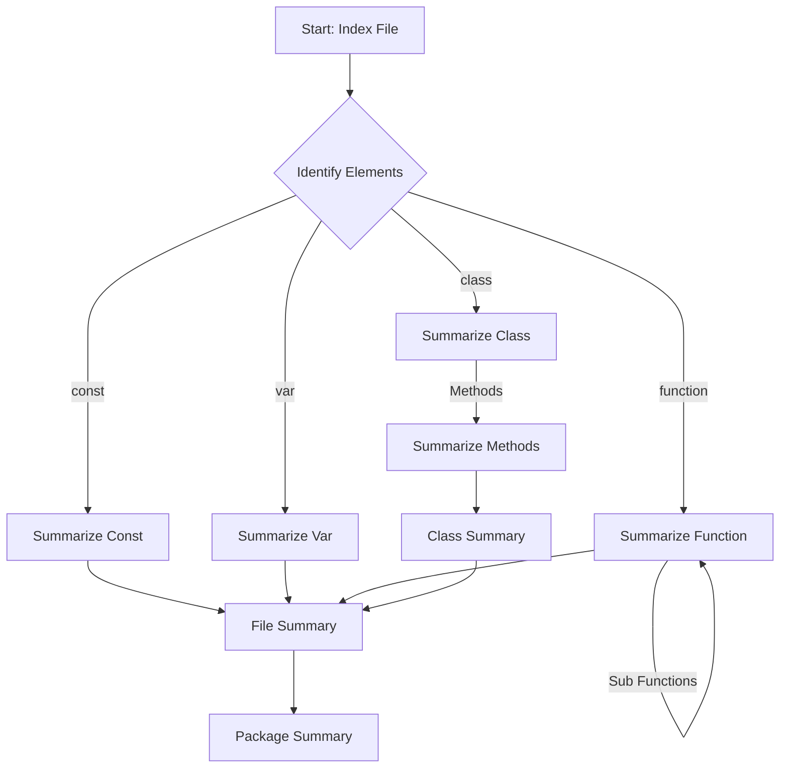
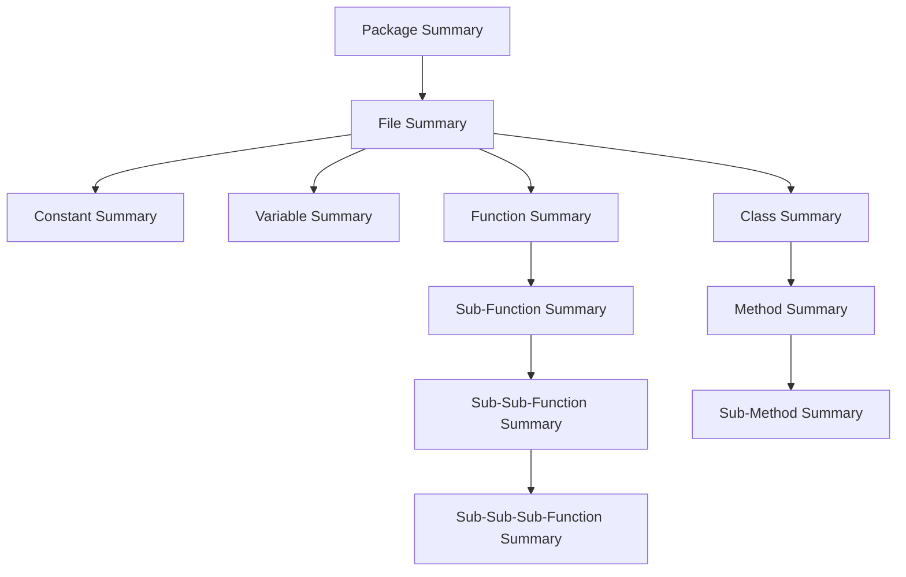

# codemapper
Semantic, relational and hierarchical code indexing aided by summaries generated by LLMs.

## Concept

### Context Generation Process


### Relationships between Summaries


### Cross-file relationships

Further context needs to be built often to understand how some constants, functions are being used....


### Tree-possiblity

Could the index be a tree-like structure... where the context gets smaller and smaller as you go down,
and stays limited to the scope of classes, functions... whatever is "selected"... and that's it...

## Running Tests

```shell
poetry run pytest
```